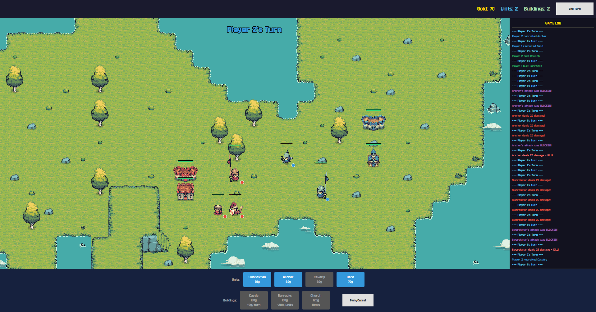
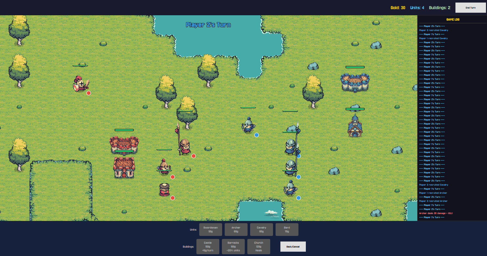

# Medieval Massacre

A two-player turn-based strategy game built in C++ and Qt Quick. Two lords share one procedurally
generated island, each confined to their own half of it, and take turns spending gold on soldiers and
buildings until one of them tears down the other's castle. Every turn buys you exactly **one** action —
recruit, build, move, or strike — so a game is a long series of small, committed decisions rather than
a flurry of clicks.



*Mid-game: Player 1 (red) holds a castle and barracks on the left, Player 2 (blue) a castle and church
on the right. The log on the right records every recruit, build, hit, block and kill — that archer's
attack was blocked twice by a swordsman before it landed.*

## Features

- **Procedurally generated islands** — a cellular-automata pass carves land out of noise, then the
  coastline, beaches, forests and cliff plateaus are layered on top. No two matches use the same map.
- **Autotiled terrain** — each tile picks its sprite from a 4-bit mask of its neighbours, so coastlines,
  cliff faces and grass edges connect seamlessly without a hand-drawn tilemap.
- **Four unit classes with real differences** — a swordsman that randomly parries, an archer that
  cannot shoot at point-blank range and hits harder from far away, cavalry that gets a charge bonus,
  and a bard.
- **Three buildings that change how you play** — a castle that prints gold and *is* your life total,
  barracks that cut recruitment costs by a fifth, and a church that heals everything nearby each turn.
- **Cliffs you have to walk around** — mountains are impassable except through a single staircase tile,
  and the ground directly under a cliff face can be neither entered nor built on.
- **Fully animated sprite work** — idle, run, attack, guard and directional cavalry strikes, all driven
  from one global frame clock so the whole board animates in step.
- **Floating combat text, a colour-coded battle log and per-action sound effects**, plus wheel zoom and
  drag-to-pan over the map.



*Later in a match. Blue has massed cavalry and archers along the centre line; the health bars above each
sprite and the coloured dot in the corner of each tile mark ownership at a glance.*

## How it works

The game is split cleanly in two. **The C++ core knows nothing about Qt** — `Game`, `Map`, `Unit`,
`Building`, `Player` and `TurnManager` are plain classes that could run in a terminal. **The Qt layer
only translates**: it exposes the core to QML and turns state changes into animations and sounds.

- **`GameController`** is the single bridge object. QML calls it (`Q_INVOKABLE`), reads from it
  (`Q_PROPERTY`) and listens to it (signals like `attackAnimationTriggered`, `floatingDamageTriggered`,
  `gameLogMessage`). Nothing in QML ever touches `Game` directly.
- **Three list models** feed the view: `MapModel` publishes every tile with its terrain, bitmask and
  occupancy; `UnitModel` and `BuildingModel` publish live actors, keyed by pointer identity so an
  animation can find the sprite it belongs to.
- **`Game`** owns the rules — validation, purchasing, movement legality, combat, win conditions —
  and `TurnManager` owns whose turn it is and when the game is over.

### One action per turn

Recruiting, building, moving and attacking all end your turn immediately. There is no move-then-shoot;
the turn *is* the action. It makes the archer's minimum range and the cavalry's charge bonus into real
decisions instead of rounding errors, and it is why matches read as a slow, deliberate advance across
the island.

### Units

| Unit | HP | Damage | Move | Range | Cost | What makes it different |
| --- | --- | --- | --- | --- | --- | --- |
| Swordsman | 100 | 25 | 2 | 2 | 50g | 30% chance to parry an incoming attack outright — no damage, guard animation, attacker's turn wasted |
| Archer | 70 | 20 | 2 | 3 | 60g | **Cannot** attack an adjacent target; deals 30 instead of 20 at distance 3 |
| Cavalry | 120 | 30 | 4 | 4 | 80g | +15 damage when it attacks without having moved that turn |
| Bard | 50 | 10 | 2 | 2 | 70g | Cheapest body on the field; carries a heal ability that is not yet wired to the UI |

All distances are Manhattan distance — `|dx| + |dy|`, no diagonals.

### Buildings

| Building | HP | Cost | Effect |
| --- | --- | --- | --- |
| Castle | 200 | 150g | +5 gold at the start of each of your turns. **Losing it loses you the game.** |
| Barracks | 150 | 100g | All your units cost 20% less while it stands |
| Church | 120 | 120g | Heals every friendly unit within 2 tiles for 10 HP at the start of your turn |

Each side starts with 300 gold and places its castle for free before the first real turn. After that a
player may only ever hold one castle, and both players are restricted to their own half of the map —
the left half for Player 1, the right for Player 2 — for everything they buy or build.

## The map

A match starts on a 32×24 island generated fresh each time:

1. Fill the grid with 56% grass, 44% water noise.
2. Smooth it six times: a tile with more than four water neighbours drowns, fewer than four dries out.
   This is what turns static into coherent landmass.
3. Prune grass with fewer than two orthogonal grass neighbours, so no one-tile pinpricks survive.
4. Force the outer ring to water — it is an island, not a cut-off continent.
5. Any grass touching water becomes beach, giving the coastline a sand border.
6. Scatter forest across 5% of the remaining grass.
7. Attempt three 3×3 mountain plateaus, each with exactly one staircase tile on its left or right edge,
   and only where a staircase can actually reach open grass.

The renderer then autotiles it. Each tile computes a 4-bit mask — north, east, south, west — of whether
its neighbour is the same kind of surface, and picks `grass_<mask>.png` accordingly. Mountains use a
second mask for their cliff faces, and the cliff sprite is drawn on the tile *below* the mountain edge so
the rock face hangs over the ground correctly. The staircase is drawn oversized and z-ordered above both.

## Animation

Every animated sprite in the game is a horizontal strip clipped to one frame at a time and shifted with
an `x` offset. All of them read from **one 100 ms timer** in `GameScreen.qml` that drives three global
counters — water on a 16-frame cycle, foliage on 8, units on 24 — so the entire board stays in phase and
there is a single timer rather than one per sprite.

On top of that clock:

- Unit position is a `Behavior on x/y` with a 400 ms eased animation; the position change itself flips the
  unit into its run cycle, and a short timer drops it back to idle when it lands.
- Attacks play through a `NumberAnimation` on a frame index, with a per-class frame count and duration.
- Cavalry picks one of five directional attack strips from the sign of `dx`/`dy`; the swordsman picks
  randomly between two attack variants so repeated swings do not look identical.
- Blocks, damage numbers and heals surface as floating text that rises and fades over 1.5 seconds.

## Getting started

You need **Qt 6** (Core, Quick, Qml, Multimedia, QuickControls2), **CMake 3.16+** and a **C++17** compiler.

```
cmake -S . -B build
cmake --build build
```

Then run `build/Projekt_CPP.exe`. Opening `CMakeLists.txt` directly in Qt Creator or CLion works too —
the project was developed that way.

From the main menu, pick **2 Players**. Each player places a castle for free, and then the game begins.
Click a unit to select it and its legal moves and targets light up; click a purchase button and every
tile you are allowed to place on gets outlined in your colour.

### Layout

```
game/            Game loop, turn management
map/             Map, Tile, terrain and position types
units/           Unit base class and the four classes
buildings/       Building base class and the three buildings
player/          Player state: gold, owned units and buildings
qmlcontroller/   GameController bridge and MapModel
qmlanimace/      UnitModel and BuildingModel
*.qml            Main menu, game screen, tile, unit and building layers
images*/         Terrain, unit and building sprite sheets
sounds/ fonts/   Audio and the pixel fonts
docs/            Screenshots
```

## Known limitations

Honest notes on what is unfinished, mostly so nobody has to find them by surprise:

- **The non-Qt fallback in `CMakeLists.txt` will not build.** If Qt 6 is missing, CMake falls back to a
  "console version" that still compiles `main.cpp`, which is Qt-only. Qt 6 is effectively required.
- **No AI and no networking.** Two players, one keyboard and mouse, hot seat.

## Credits

The code is mine. The sprite sheets, tilesets, pixel fonts and sound effects under `images/`,
`images_units/`, `images_buildings/`, `fonts/` and `sounds/` are third-party assets used for a school
project — check their original licences before reusing any of them elsewhere.

* **2D Art Assets:** [Tiny Swords](https://pixelfrog-assets.itch.io/tiny-swords) by [Pixel Frog](https://pixelfrog-assets.itch.io/).
